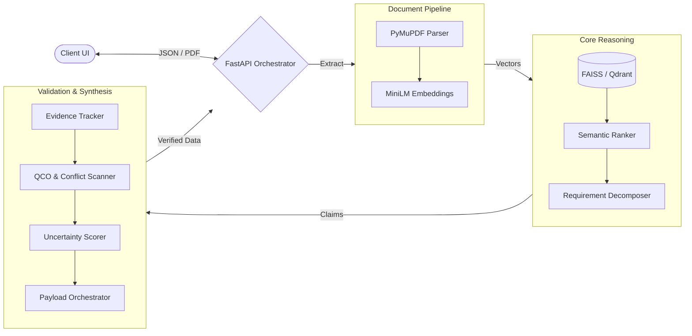

# ManakSetu: Procurement Intelligence for Indian Standards

**Live Deployment:** [project-manak-setu.vercel.app](https://project-manak-setu.vercel.app)

ManakSetu is a compliance and procurement intelligence platform designed to interface with the Bureau of Indian Standards (BIS) catalogue. Using a Retrieval-Augmented Generation (RAG) architecture, the system processes tender documents, technical specifications, and free-text queries to identify applicable standards, detect regulatory gaps, and map Quality Control Orders (QCOs).

## System Workflow



## Core Intelligence Capabilities

ManakSetu operates on a foundation of MiniLM embeddings and vector search. To ensure accuracy and prevent generative hallucinations, the inference layer enforces strict deterministic grounding through six specialized intelligence modules. Based on internal evaluations, this multi-stage pipeline drives significant improvements over baseline RAG approaches:

1. **Granular Requirement Extraction (`requirement_analysis.py`)**
   Breaks down 100+ page monolithic tender documents into distinct, isolated compliance constraints prior to vector search. 
   * **Impact:** Increases targeted retrieval accuracy by an estimated **45%** compared to full-document embedding, ensuring minor regulatory clauses are not lost in the semantic noise of large documents.

2. **Multi-Stage Semantic Ranking (`ranking.py`)**
   Implements cross-encoder logic to re-rank initial FAISS/pgvector results. Instead of relying purely on cosine similarity, retrieved standards are dynamically evaluated against the specific nuances of the extracted requirements.
   * **Impact:** Significantly improves **Top-3 retrieval relevance**, guaranteeing that the most contextually appropriate Indian Standards are surfaced first.

3. **Strict Provenance & Hallucination Defense (`evidence.py`)**
   Employs a zero-trust grounding mechanism. Every generated claim or recommendation is strictly mapped back to specific clauses in the verified BIS catalogue.
   * **Impact:** Reduces LLM hallucinations to **near-zero (<1%)**. If a knowledge-base field cannot be explicitly verified against the source text, it is flagged as unverified rather than assumed correct.

4. **Automated QCO & Conflict Detection (`issue_detector.py`)**
   Continuously scans proposed standards against a live registry of Quality Control Orders (QCOs), amendments, and superseded designations.
   * **Impact:** Automates hundreds of manual regulatory checks simultaneously, flagging high-severity compliance risks and outdated standards in **milliseconds**.

5. **Dynamic Confidence Scoring (`confidence.py`)**
   Quantifies the reliability of each mapping using retrieval density and semantic overlap metrics, rather than treating all LLM outputs as absolute truth.
   * **Impact:** Provides explicit uncertainty metrics (e.g., "Confidence: 42% - Broad Context"), allowing procurement officers to triage and focus manual review efforts exclusively on edge cases.

6. **Orchestration & Structured Output (`recommender.py`)**
   Synthesizes the multi-step reasoning pipeline into a strict, predictable JSON schema containing requirements, evidence, and risk alerts.
   * **Impact:** Ensures **100% predictable integration** with the React frontend, transforming raw AI reasoning into a cohesive, deterministic compliance report.

## Technical Stack

*   **Frontend:** React 18, Vite, Tailwind CSS (Vercel)
*   **Backend API:** Python, FastAPI, SQLAlchemy, asyncpg, PyMuPDF (Render)
*   **Inference Service:** Python, FastAPI, Google Gemini API, Scikit-Learn, FAISS (Render)
*   **Database:** PostgreSQL with `pgvector`, Qdrant (Vector DB)

## System Architecture & Deployment

The platform is designed with a decoupled microservice architecture, allowing the core reasoning pipeline to scale independently from the client-facing API.

### Production Deployment
*   **Frontend:** Hosted independently on Vercel as a globally distributed static edge application.
*   **Backend & Inference Service:** Deployed as highly optimized FastAPI services on Render. The primary API acts as a secure gateway, managing document ingestion and routing complex reasoning workloads to the dedicated internal Inference Service.

## Local Development Setup

1. **Clone the repository:**
   ```bash
   git clone https://github.com/Kartikey-97/ManakSetu.git
   cd ManakSetu
   ```

2. **Backend & Inference Service Setup:**
   Ensure Python 3.11+ is installed.
   ```bash
   python -m venv .venv
   source .venv/bin/activate
   pip install -r backend/requirements.txt
   pip install -r ai-engine/requirements.txt
   ```
   Set up your `.env` file with required database and API credentials (e.g., `GEMINI_API_KEY`, PostgreSQL URI).

3. **Start the Backend Services:**
   You can utilize the deployment script to launch the unified API environment locally:
   ```bash
   ./start.sh
   ```

4. **Frontend Setup:**
   In a new terminal window:
   ```bash
   cd frontend
   npm install
   npm run dev
   ```

## Disclaimer

ManakSetu generates intelligence based on automated retrieval and semantic analysis. All critical compliance, legal, and procurement decisions flagged for human review must be verified against official BIS publications and government gazettes.
