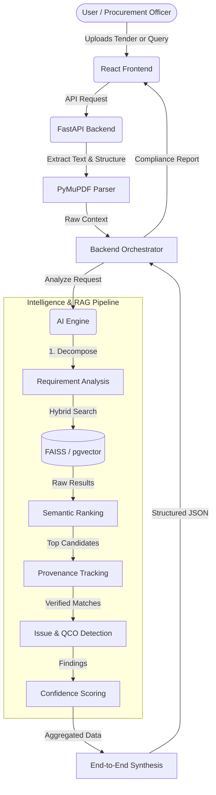

# ManakSetu: Procurement Intelligence for Indian Standards

**Live Deployment:** [project-manak-setu.vercel.app](https://project-manak-setu.vercel.app)

ManakSetu is a compliance and procurement intelligence platform designed to interface with the Bureau of Indian Standards (BIS) catalogue. Using a Retrieval-Augmented Generation (RAG) architecture, the system processes tender documents, technical specifications, and free-text queries to identify applicable standards, detect regulatory gaps, and map Quality Control Orders (QCOs).

## System Workflow



## Core Intelligence Capabilities

ManakSetu operates on a foundation of MiniLM embeddings and vector search. To ensure accuracy and prevent generative hallucinations, the AI engine enforces strict deterministic grounding through specialized intelligence modules:

*   **Requirement Extraction & Decomposition**: Rather than evaluating entire monolithic documents at once, the system parses complex tenders into granular, isolated requirements. This enables highly targeted standard matching.
*   **Semantic Relevance & Ranking**: Moves beyond simple vector distance calculation. Retrieved standards are evaluated against the specific nuances of the extracted requirements, ensuring true contextual relevance.
*   **Strict Provenance Tracking**: Hallucinations are mitigated by anchoring every recommendation to exact text within the verified BIS record. If a knowledge-base field is unverified, it is explicitly flagged to the user.
*   **Automated Issue Detection**: The system actively scans retrieved standards against current regulatory rules, flagging outdated designations, conflicting specifications, and QCO compliance failures for human review.
*   **Confidence Scoring**: Assigns reliability metrics to each match based on the quality of the retrieval and the density of the context, openly acknowledging uncertainty when source data is ambiguous.
*   **Structured Synthesis**: A final orchestration layer compiles the granular analyses, ranked standards, evidence, and actionable alerts into a cohesive, structured payload for the frontend.

## Technical Stack

*   **Frontend:** React 18, Vite, Tailwind CSS (Vercel)
*   **Backend API:** Python, FastAPI, SQLAlchemy, asyncpg, PyMuPDF (Render)
*   **AI Engine:** Python, FastAPI, Google Gemini API, Scikit-Learn, FAISS (Render)
*   **Database:** PostgreSQL with `pgvector`

## System Architecture & Deployment

To optimize resource utilization, the backend and AI Engine are designed to run concurrently within a single environment, communicating over local HTTP interfaces. 

### Production Deployment
*   **Frontend:** Hosted independently on Vercel.
*   **Backend & AI Engine:** Orchestrated via `start.sh` to run in a single Render container. 
    *   The AI Engine operates on an internal port (`10001`) in a lightweight inference mode (`SKIP_RECOMMENDER=true`), loading the pre-trained `.joblib` applicability models directly into memory.
    *   The public-facing Backend binds to the environment `$PORT` and routes analysis requests to the internal AI Engine.

## Local Development Setup

1. **Clone the repository:**
   ```bash
   git clone https://github.com/Kartikey-97/ManakSetu.git
   cd ManakSetu
   ```

2. **Backend & AI Engine Setup:**
   Ensure Python 3.11+ is installed.
   ```bash
   python -m venv .venv
   source .venv/bin/activate
   pip install -r backend/requirements.txt
   pip install -r ai-engine/requirements.txt
   ```
   Set up your `.env` file with required database and API credentials (e.g., `GEMINI_API_KEY`, PostgreSQL URI).

3. **Start the Backend Services:**
   You can utilize the deployment script to launch both the API and the AI engine locally:
   ```bash
   ./start.sh
   ```

4. **Frontend Setup:**
   In a new terminal window:
   ```bash
   cd frontend
   npm install
   npm run dev
   ```

## Disclaimer

ManakSetu generates intelligence based on automated retrieval and semantic analysis. All critical compliance, legal, and procurement decisions flagged for human review must be verified against official BIS publications and government gazettes.
